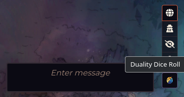
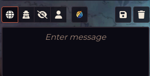

# Duality Dice Roller (Foundry VTT v13 Module)

A simple Foundry VTT module that adds a custom **"Duality Dice Roller"** button to the chat controls.  
Clicking the button automatically runs the `/dr` chat command.
Works only with the Foundryborne Daggerheart system.

---

## ✨ Features
- Adds a new dice button with a custom SVG icon made byt he awesome @UsernameIsInUse.
- One-click execution of `/dr`.

---

## 📦 Installation

1. In Foundry VTT, go to **Settings → Add-on Modules → Install Module**.
2. Paste this manifest link: `https://github.com/cptn-cosmo/DualityDiceRoller/releases/latest/download/module.json`
3. Enable the module in **World Settings → Manage Modules**.

---

## 🔨 Usage
- Look for the **Duality Dice Roller** button (custom dice icon).
- Click it → Duality Dice Roll window pops up.

## 🖼️ Screenshots

